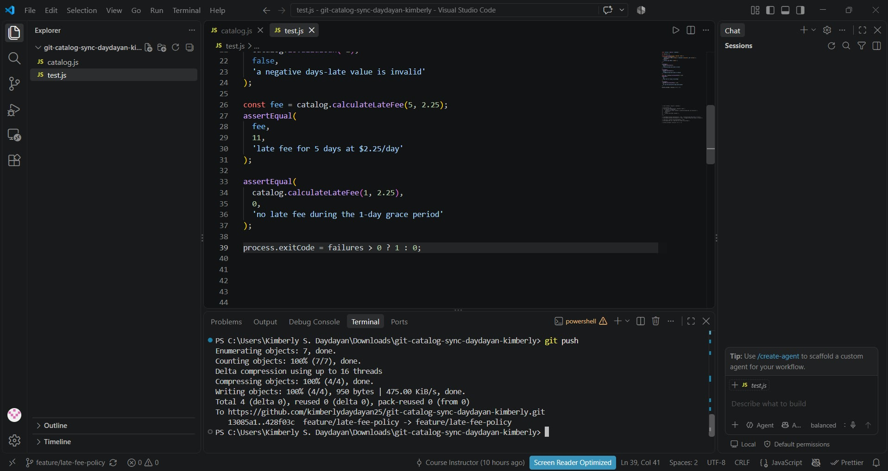
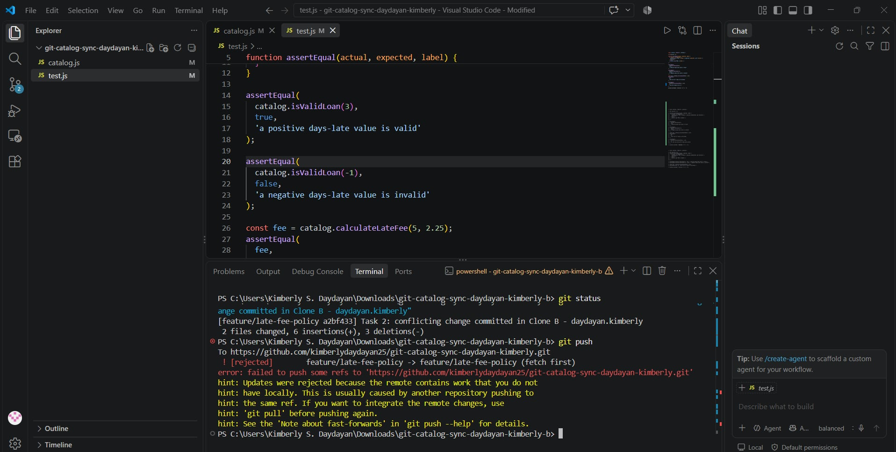
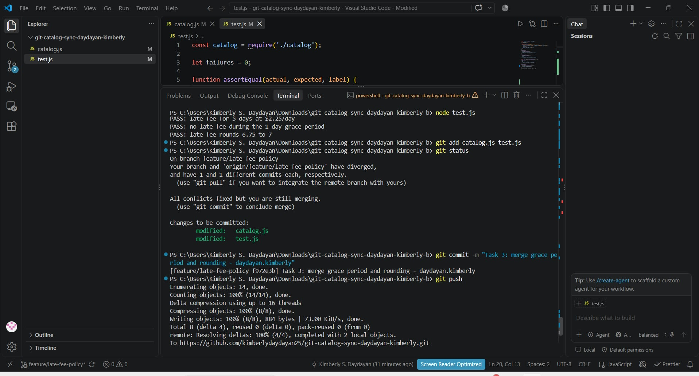
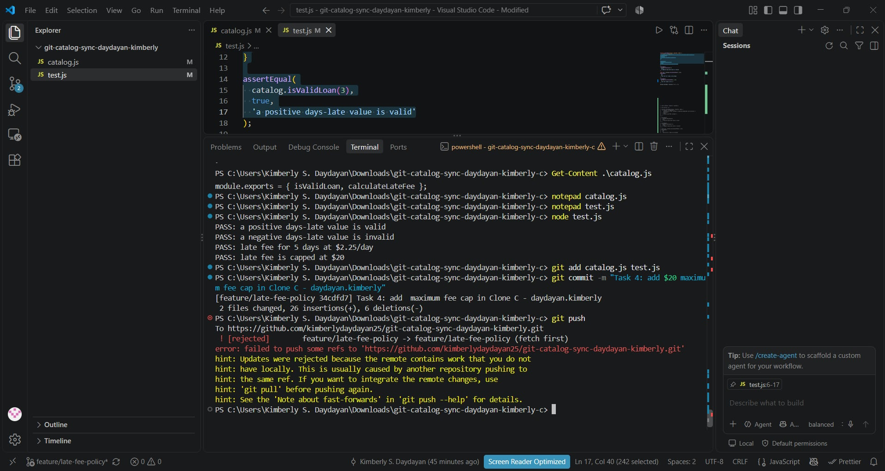
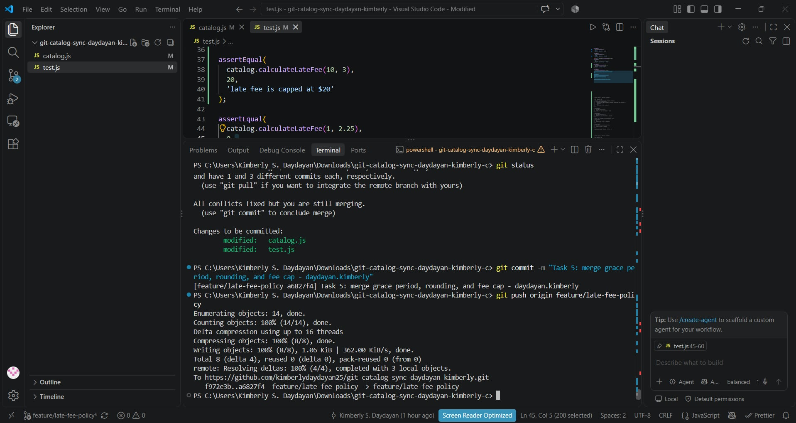
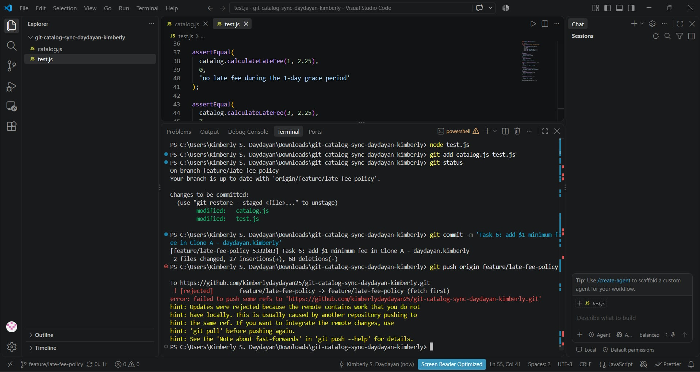
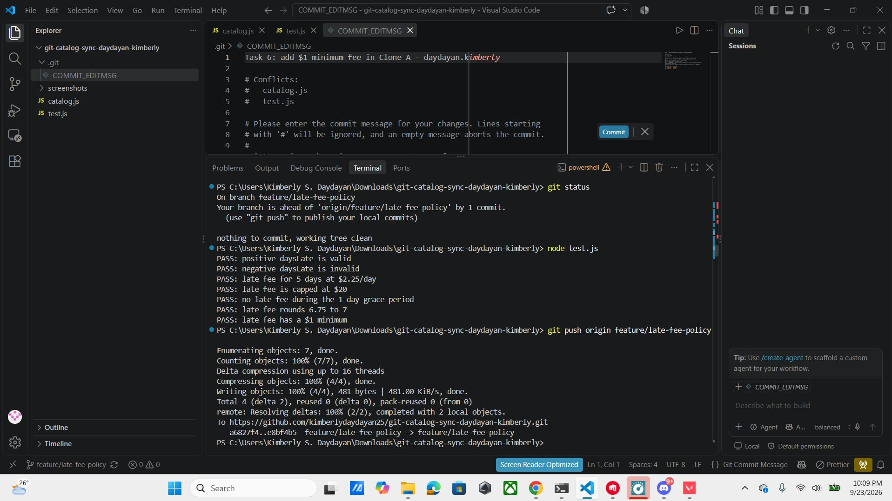

# Catalog Sync: Reconciling 3-Way Divergent Work

## Screenshots Evidence

### Task 1: Grace Period from Clone A

### Task 2: Rounding from Clone B (Push Rejected)

### Task 3: Reconcile Conflict in Clone B (Merge)

### Task 4: Fee Cap from Clone C (Push Rejected)

### Task 5: Three-Way Merge Conflict in Clone C

### Task 6: Minimum Fee in Clone A (Rebase Reconcile)

### Task 7: Merged into main and Tagged

---

## Workflow Questions

### 1. Final `calculateLateFee` Walkthrough
* **Grace Period (`daysLate <= 1`):** Added by **Contributor 1 (Clone A, Task 1)**. Returns `0` immediately if the item is returned within 1 day late.
* **Fee Rounding (`Math.round`):** Added by **Contributor 2 (Clone B, Task 2)**. Replaced integer truncation so partial or fractional daily fees round to the nearest whole dollar.
* **$20 Maximum Cap (`Math.min(..., 20)`):** Added by **Contributor 3 (Clone C, Task 4)**. Ensures that no matter how many days late an item is, the total fee never exceeds $20.
* **$1 Minimum Fee (`Math.max(fee, 1)`):** Added by **Contributor 1 (Clone A, Task 6)**. Guarantees that any non-zero fee outside the grace period is at least $1.

### 2. Comparing Task 3 (Two-Way) vs. Task 5 (Three-Way) Conflicts
In **Task 3**, the merge conflict only involved two lines of work (grace period vs. fee rounding). Resolving it was straightforward because both additions could easily sit side-by-side. 

In **Task 5**, the conflict was significantly more complex because Clone C was completely unaware of **both** previous features (grace period AND rounding) while introducing a third rule ($20 maximum cap). Resolving a three-way conflict required manually reconstructing the whole function logic so all three business rules executed in the correct logical sequence without overwriting each other.

### 3. Difference Between Task 5 (Merge) and Task 6 (Rebase)
* **Task 5 (Merge):** Combined the histories using a merge commit. It explicitly preserves the branching points and shows where divergent timelines joined back together.
* **Task 6 (Rebase):** Rewrote history by taking Clone A's commit and re-applying it on top of the latest upstream commits from `origin/feature/late-fee-policy`. Instead of creating a merge commit, it created a clean, linear commit timeline.

### 4. Process Change to Prevent Rejected Pushes
To prevent rejected pushes in a real team of three, we should establish a **Feature Branching and Pull Request (PR) Workflow**:
1. Teammates should never commit directly to a shared branch. Each feature should be built on its own short-lived feature branch.
2. Developers must run `git fetch` and `git pull --rebase` before pushing to ensure their local branch is up to date.
3. Code should be merged into `main` via Pull Requests with mandatory CI testing to catch conflicts before merging.